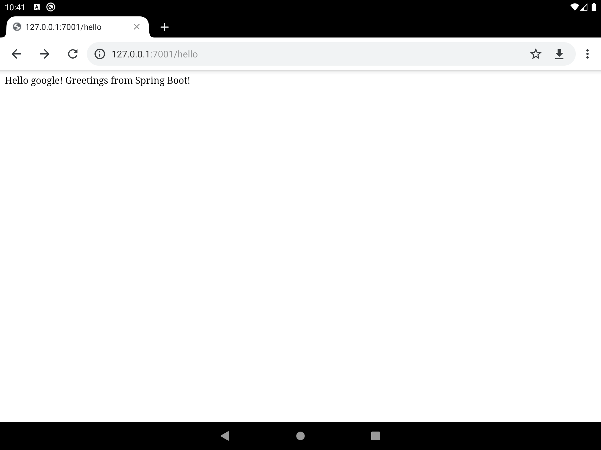

## Running SpringBoot in Android
Running SpringBoot in Android, turn Android device into a web server.
Tested on Android 9

### TODO:
1. [AndroidConfigurationClassPostProcessor.java](app/src/main/java/org/springframework/context/annotation/AndroidConfigurationClassPostProcessor.java) Support CGLIB [1](https://github.com/zhangke3016/MethodInterceptProxy)
2. Template engines not yet tested

PS：not spring's `SpringBoot for android`
