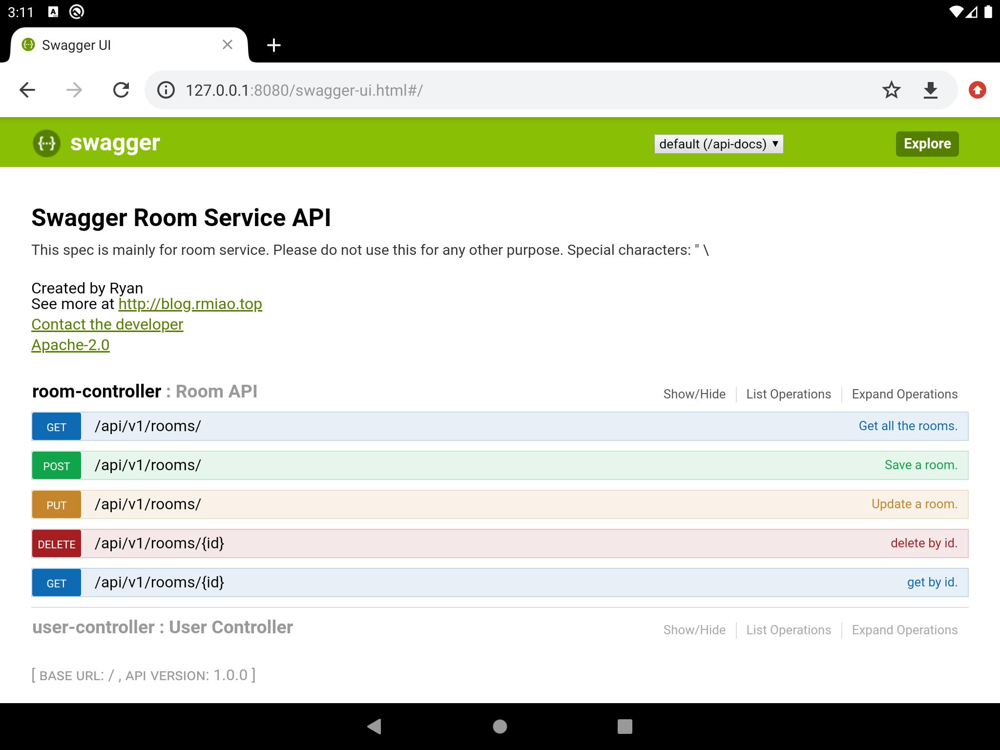

## Running SpringBoot in Android
Running SpringBoot in Android, turn Android device into a web server.
Tested on Android 9

*demo project placed in web module, which copied from https://github.com/Ryan-Miao/springboot-demo-gradle*

### Working:
1. CGLIB
2. Template engines
3. Database

### Not Working:
1. Auto parameter name resolving not working, RequestParam and PathVariable annotations MUST provided parameter name in order to work.

PS：not spring's `SpringBoot for android`
