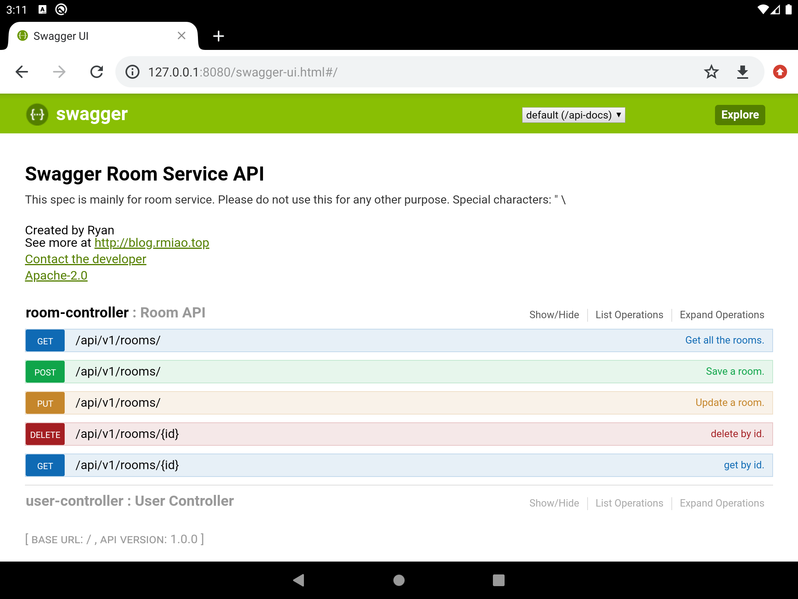

## Running SpringBoot in Android
## 在 Android 中运行 SpringBoot
这个项目用于在 Android 中启动 SpringBoot 服务，也就是把 Android 设备当成服务器，
已在Android 9模拟器测试过

*截图的demo项目位于web模块，来自 https://github.com/Ryan-Miao/springboot-demo-gradle*

### 有效功能:
1. CGLIB
2. 模板引擎
3. 数据库

### 无效功能:
1. 方法的参数名称无法通过反射获取，RequestParam和PathVariable注解都需要填参数名称才能生效

PS：spring官方的 `SpringBoot for android` 是在服务器部署RESTful接口给Android调用
